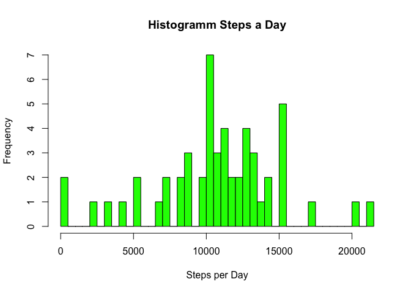
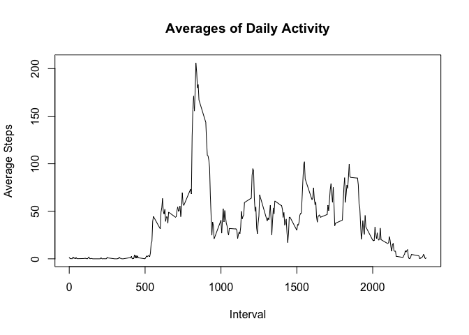
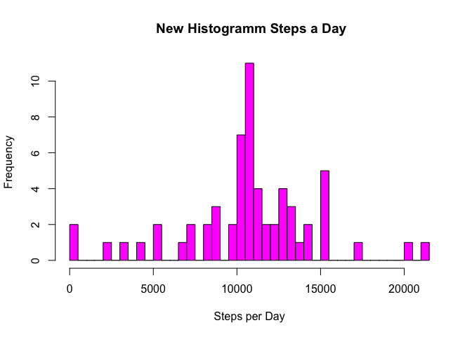
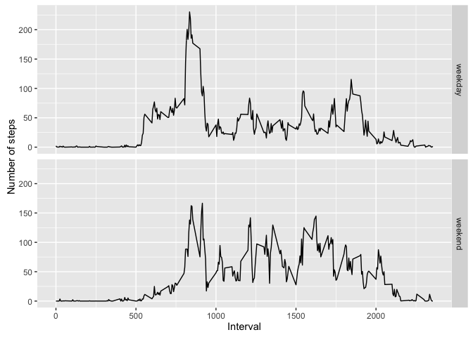

# Reproducible Research: Peer Assessment 1


## Loading and preprocessing the data

The data has been loaded from the GitHub Repository und unzipped in my working directory.


```r
act <- read.csv("activity.csv")
```

The data has been checked.


```r
head(act)
```

```
##   steps       date interval
## 1    NA 2012-10-01        0
## 2    NA 2012-10-01        5
## 3    NA 2012-10-01       10
## 4    NA 2012-10-01       15
## 5    NA 2012-10-01       20
## 6    NA 2012-10-01       25
```

```r
summary(act)
```

```
##      steps                date          interval     
##  Min.   :  0.00   2012-10-01:  288   Min.   :   0.0  
##  1st Qu.:  0.00   2012-10-02:  288   1st Qu.: 588.8  
##  Median :  0.00   2012-10-03:  288   Median :1177.5  
##  Mean   : 37.38   2012-10-04:  288   Mean   :1177.5  
##  3rd Qu.: 12.00   2012-10-05:  288   3rd Qu.:1766.2  
##  Max.   :806.00   2012-10-06:  288   Max.   :2355.0  
##  NA's   :2304     (Other)   :15840
```

## What is mean total number of steps taken per day?

Calculate the total number of steps taken per day.


```r
stepsPerDay <- aggregate(steps~date,act,sum)
```

Make a histogramm of the total number of steps taken each day.


```r
hist(stepsPerDay$steps,main="Histogramm Steps a Day",breaks=60,col="green",
     xlab="Steps per Day")
```

<!-- -->

Calculate mean and median values.


```r
mean(stepsPerDay$steps)
```

```
## [1] 10766.19
```

```r
median(stepsPerDay$steps)
```

```
## [1] 10765
```

## What is the average daily activity pattern?

Calculate average.


```r
avgActPattern <- aggregate(steps~interval,act,mean)
```

Make a plot.


```r
plot(avgActPattern$interval,avgActPattern$steps,type="l",
     main="Averages of Daily Activity",xlab="Interval",ylab="Average Steps")
```

<!-- -->

Get a highest average of number of steps and interval accordingly.


```r
maxAvg<-max(avgActPattern$steps)
subset(avgActPattern, steps == maxAvg)
```

```
##     interval    steps
## 104      835 206.1698
```

## Imputing missing values

Calculate the total number of missing values in the dataset.


```r
sum(is.na(act))
```

```
## [1] 2304
```

A strategy for filling in all of the missing values in the dataset: setting an average of the number of steps in the same interval as integer.

Create a new dataset like original dataset but with the missing data filled in.
Check the result.


```r
actTrans<-transform(act,steps=ifelse(is.na(act$steps),as.integer(avgActPattern$steps),act$steps))
sum(is.na(actTrans))
```

```
## [1] 0
```

Make a histogramm of the total number of steps taken each day.
Calculate the mean and median total number of steps taken per day.


```r
stepsPerDayTrans <- aggregate(steps~date,actTrans,sum)
hist(stepsPerDayTrans$steps,main=" New Histogramm Steps a Day",breaks=60,col="magenta",
     xlab="Steps per Day")
```

<!-- -->

```r
mean(stepsPerDayTrans$steps)
```

```
## [1] 10749.77
```

```r
median(stepsPerDayTrans$steps)
```

```
## [1] 10641
```

These values differ from the estimates from the first part of the assignment.
The impact is that the both values are shrunk, because an integer as smaller or equal to a decimal.
But it is a small difference, barely visible in a histogram.

## Are there differences in activity patterns between weekdays and weekends?

Create a new variable in a dataset as factor.


```r
library(dplyr)
```

```
## 
## Attaching package: 'dplyr'
```

```
## The following objects are masked from 'package:stats':
## 
##     filter, lag
```

```
## The following objects are masked from 'package:base':
## 
##     intersect, setdiff, setequal, union
```

```r
actTrans<-mutate(actTrans,
        dayFlag=as.factor(ifelse(weekdays(as.Date(actTrans$date))=="Samstag"|
        weekdays(as.Date(actTrans$date))=="Sonntag","weekend","weekday")))
```

Make a panel plot.


```r
library(ggplot2)
avgActPatternDayFlag<-aggregate(steps~interval+dayFlag,actTrans,mean)
qplot(interval,steps,data=avgActPatternDayFlag,geom="line",
      xlab="Interval",ylab="Number of steps",facets=dayFlag~.)
```

<!-- -->


